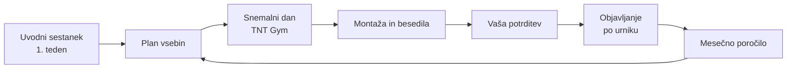

# Hungry Goat × Sadless Media — predlog sodelovanja

Cilj prvih 3 mesecev je, da Hungry Goat pridobi prvih 10 plačljivih strank prek Instagrama in spletne strani. Profil bo gradil zaupanje, pritegnil ljudi med 25 in 50 let iz Maribora in okolice ter jih pripeljal do prijave na brezplačen posvet.

Vsebina podpira tri storitve: **osebne treninge 1 na 1** v TNT Gym Maribor, **online coaching** in **skupinske vadbe**. Snemanje, fotografiranje, montažo, besedila in objavljanje opravim sam, zato imate enega sogovornika in enoten vizualni stil (črna, kost-bela in oranžna, kot na logotipu).

Spodaj sta primerjava paketov **Začetek** in **Rast**, konkreten plan za prvi mesec pri vsakem od njiju, potek sodelovanja in cena spletne strani.

## Primerjava paketov

Razlika je predvsem v količini videov in v tem, ali prevzamem tudi komunikacijo s sledilci. Oboje najbolj vpliva na hitrost pridobivanja strank.

|  | Paket 01 – Začetek | Paket 02 – Rast |
| --- | --- | --- |
| Cena | 290 € / mesec | 490 € / mesec |
| Objave na feedu | 8 na mesec | 12 na mesec |
| Reelsi (snemanje in montaža) | 2 na mesec | 4 na mesec |
| Zgodbe (stories) | 3× na teden | 5× na teden |
| Snemalni dan | 1× na mesec, 2 uri | 1× na mesec, 4 ure |
| Besedila, ključniki, objavljanje | Da | Da |
| Odgovarjanje na komentarje in DM | Ne, to delate sami | Da |
| Vsebinski plan za mesec naprej | Ne | Da |
| Poročilo | Kratko mesečno poročilo | Poročilo z dosegom in rastjo |
| Primerno za | Urejen profil in redno prisotnost | Hitrejšo rast in aktivno pridobivanje strank |

Cene so v evrih. Nisem zavezanec za DDV, zato se DDV ne obračuna.

## Paket 01 – Začetek (290 € / mesec)

Začetek poskrbi za urejen, profesionalen profil z 2 objavama na teden in rednimi zgodbami. Primeren je, če želite počasnejšo, a stabilno rast in boste sporočila ter komentarje urejali sami.

### Tedenski ritem

| Dan | Kaj se objavi |
| --- | --- |
| Ponedeljek | Objava na feedu (fotografija ali carousel) |
| Četrtek | Objava na feedu ali reel (reel vsak drugi teden) |
| 3 dni v tednu | Zgodbe: zakulisje treningov, ankete, vprašanja |

### Plan vsebin za prvi mesec

**Objave na feedu (8)**

1. Predstavitev: »Kdo sem in zakaj Hungry Goat«, portret iz TNT Gym
2. Tri storitve na enem mestu: 1 na 1, online coaching, skupinske vadbe (carousel)
3. »3 napake, zaradi katerih po 30. letu ne napreduješ« (carousel z nasveti)
4. Akcija Founding Members: prvih 10 strank −30 % za 3 mesece
5. Primer dneva prehrane za zaposlenega človeka (carousel)
6. Trening v TNT Gym, akcijska fotografija z nasvetom za pravilno tehniko
7. »Hungry, ampak na dieti?« Velike porcije z malo kalorijami
8. Vabilo na brezplačen posvet s povezavo na spletno stran

**Reelsi (2)**

1. »Zakaj sem svojo znamko poimenoval Hungry Goat«, pripet na vrh profila
2. »Trening za 20 minut, ko nimaš časa«, posnetek iz TNT Gym

### Snemalni dan (2 uri)

V 2 urah v TNT Gym posnamem oba reelsa in fotografije za 8 objav. Ker je čas kratek, pripravim natančen seznam kadrov vnaprej.

### Kaj lahko pričakujete

- Profil bo po prvem mesecu urejen in bo deloval profesionalno.
- Rast sledilcev bo zmerna, ker 2 reelsa na mesec dosežeta manj novih ljudi.
- Na sporočila in komentarje odgovarjate sami, najbolje v nekaj urah, ker tam nastajajo stranke.

## Paket 02 – Rast (490 € / mesec)

Rast podvoji število reelsov in doda komunikacijo s sledilci. Reelsi prinašajo nove ljudi, hiter odgovor na sporočila pa jih spremeni v stranke. Primeren je, če želite prve stranke čim prej.

### Tedenski ritem

| Dan | Kaj se objavi |
| --- | --- |
| Ponedeljek | Reel (trening ali prehrana) |
| Sreda | Objava na feedu (nasvet ali carousel) |
| Petek | Objava na feedu (rezultat, zgodba ali ponudba) |
| 5 dni v tednu | Zgodbe: zakulisje, ankete, vprašanja, odgovori sledilcem |
| Vsak dan | Odgovori na komentarje in sporočila |

### Plan vsebin za prvi mesec

**Objave na feedu (12)**

1. Predstavitev: »Kdo sem in zakaj Hungry Goat«, portret iz TNT Gym
2. Tri storitve na enem mestu: 1 na 1, online coaching, skupinske vadbe (carousel)
3. »3 napake, zaradi katerih po 30. letu ne napreduješ« (carousel)
4. Akcija Founding Members: prvih 10 strank −30 % za 3 mesece
5. Primer dneva prehrane za zaposlenega človeka (carousel)
6. Akcijska fotografija iz TNT Gym z nasvetom za tehniko
7. »Hungry, ampak na dieti?« Velike porcije z malo kalorijami
8. Nakupovalni seznam iz trgovine za 5 dni (carousel)
9. Mit ali resnica: 5 trditev o hujšanju (carousel)
10. Napoved skupinske vadbe: termin, lokacija, prijava
11. Odgovor na najpogostejše vprašanje sledilcev
12. Vabilo na brezplačen posvet s povezavo na spletno stran

**Reelsi (4)**

1. »Zakaj sem svojo znamko poimenoval Hungry Goat«, pripet na vrh profila
2. »Trening za 20 minut, ko nimaš časa«, posnetek iz TNT Gym
3. »Nehaj delati počepe tako«, napačna in pravilna izvedba
4. »Krožnik z roko: obrok brez tehtnice in štetja«

### Snemalni dan (4 ure)

V 4 urah posnamem 4 reelse, fotografije za 12 objav in dodatne kratke posnetke za zgodbe. Snemamo v TNT Gym in v kuhinji za prehranske vsebine.

### Komunikacija s sledilci

- Odgovarjam na komentarje in sporočila v vašem imenu in tonu, po dogovorjenih pravilih.
- Vprašanja o cenah in terminih preusmerim na prijavni obrazec ali vam jih posredujem isti dan.
- Pri reelsih uporabimo ključno besedo (npr. »Komentiraj GOAT«), da ljudje sami začnejo pogovor.

### Kaj lahko pričakujete

- Opazno večji doseg zaradi 4 reelsov na mesec.
- Nobeno sporočilo potencialne stranke ne ostane neodgovorjeno.
- Mesečno poročilo z dosegom, rastjo sledilcev in številom prijav na posvet.
- Plan za naslednji mesec je pripravljen vnaprej, tako da veste, kaj snemamo.

## Kako poteka sodelovanje

Vsak mesec poteka po enakem zaporedju. Od vas potrebujemo le uvodni pogovor, snemalni dan in potrditev objav.

Po poročilu se krog ponovi: kar je delovalo najbolje, dobi naslednji mesec več prostora.

| Korak | Kdaj | Kaj se zgodi |
| --- | --- | --- |
| Uvodni sestanek | Prvi teden, samo na začetku | Pogovor o ciljih, ceni storitev, tonu komunikacije in dostopih do profila |
| Plan vsebin | Pred snemanjem | Seznam objav in reelsov za mesec; pri paketu Rast ga dobite za mesec naprej |
| Snemalni dan | Enkrat na mesec | 2 uri (Začetek) ali 4 ure (Rast) v TNT Gym |
| Montaža in besedila | V tednu po snemanju | Montaža reelsov, obdelava fotografij, besedila in ključniki |
| Vaša potrditev | Pred objavo | Vse vsebine dobite v pregled in jih potrdite ali popravite |
| Objavljanje | Skozi ves mesec | Objave in zgodbe po tedenskem ritmu paketa |
| Poročilo | Konec meseca | Rezultati in predlogi za naslednji mesec |

### Kaj potrebujem od vas

- Dostop do Instagram profila Hungry Goat (poslovni račun)
- Dogovor s TNT Gym, da lahko tam snemamo
- Termin za snemalni dan vsak mesec
- Cene in pogoje storitev ter ponudbo Founding Members
- Potrditev objav v 48 urah, da ostanemo na urniku
- Pri paketu Začetek: hitri odgovori na sporočila in komentarje

## Vzpostavitev spletne strani

Vzpostavitev spletne strani stane enkratno **590 €**, ob sklenitvi paketa Rast pa **490 €**. Prva verzija je že oblikovana s fotografijami s fotografiranja in logotipom Hungry Goat, zato je lahko objavljena v 7 dneh po prejemu končnih podatkov.

### Kaj vključuje

- Enostranska spletna stran v slovenščini in angleščini s preklopom jezika
- Prilagoditev za telefone, tablice in računalnike
- Predstavitev treh storitev s cenami in akcijo Founding Members
- Razdelki O meni, Kako začnemo, Rezultati strank, Pogosta vprašanja
- Prijavni obrazec za brezplačen posvet, prijave prihajajo na vaš e-mail
- Povezava na Instagram profila Hungry Goat in Hungry Goat Clothing
- Osnovna optimizacija za iskanje »osebni trener Maribor« in poslovni e-naslov na domeni hungrygoat.com
- Ureditev profila Google Business za prikaz na Google Zemljevidih
- Objava strani in povezava z domeno

### Dodatni stroški

| Postavka | Stanje | Opomba |
| --- | --- | --- |
| Domena hungrygoat.com | Zakupljena pri Neoserv | Domena je vaša, podaljšuje se letno |
| Gostovanje | Neoserv, Oranžni paket (zakupi stranka) | Na njem teče spletna stran, kasneje tudi trgovina |
| SSL certifikat | Neoserv (zakupi stranka) | Varna povezava https, obvezna za obrazce in plačila |
| Vzdrževanje (neobvezno) | 25 € / mesec | Posodobitve cen, izjav strank in fotografij; pri paketu Rast manjše spremembe brez doplačila |

Za objavo potrebujem vaše ime, e-mail, Instagram naslov, končne cene in 2 do 3 stavke vaše zgodbe. Izjave strank na strani so trenutno primeri in se ob objavi zamenjajo s pravimi ali odstranijo.

### Kasneje: spletna trgovina

Spletna trgovina za Hungry Goat Clothing pride v drugi fazi, ko bo prva kolekcija pripravljena. Postavimo jo na istem gostovanju pri Neoserv, cena bo v ločeni ponudbi.

Za trgovino je treba urediti:

- Plačila s kartico, PayPal in predračun
- Samodejno izdajanje računov kupcem po e-pošti ob vsakem nakupu
- Davke in davčno potrjevanje računov: preveriti z računovodjo, kaj velja za plačila prek spleta
- Splošne pogoje poslovanja, politiko zasebnosti in 14-dnevno pravico do odstopa od nakupa
- Pošiljanje (npr. Pošta Slovenije ali paketomati) in zalogo po velikostih

## Priporočilo in naslednji koraki

Za prve 3 mesece priporočam **paket Rast**, ker je cilj čim hitreje pridobiti stranke. Štirje reelsi na mesec dosežejo več novih ljudi, odgovarjanje na sporočila pa pomeni, da se nobena potencialna stranka ne izgubi.

Skupaj s spletno stranjo to pomeni **490 € enkratno** za spletno stran in **490 € na mesec** za vodenje profila. Če se profil po 3 mesecih dobro postavi, lahko preidemo na paket Začetek.

1. Izbira paketa in potrditev ponudbe
2. Uvodni sestanek: cilji, cene storitev, ton komunikacije, dostopi
3. Dogovor s TNT Gym za snemanje
4. Prvi snemalni dan in objava spletne strani
5. Začetek objavljanja po tedenskem ritmu
